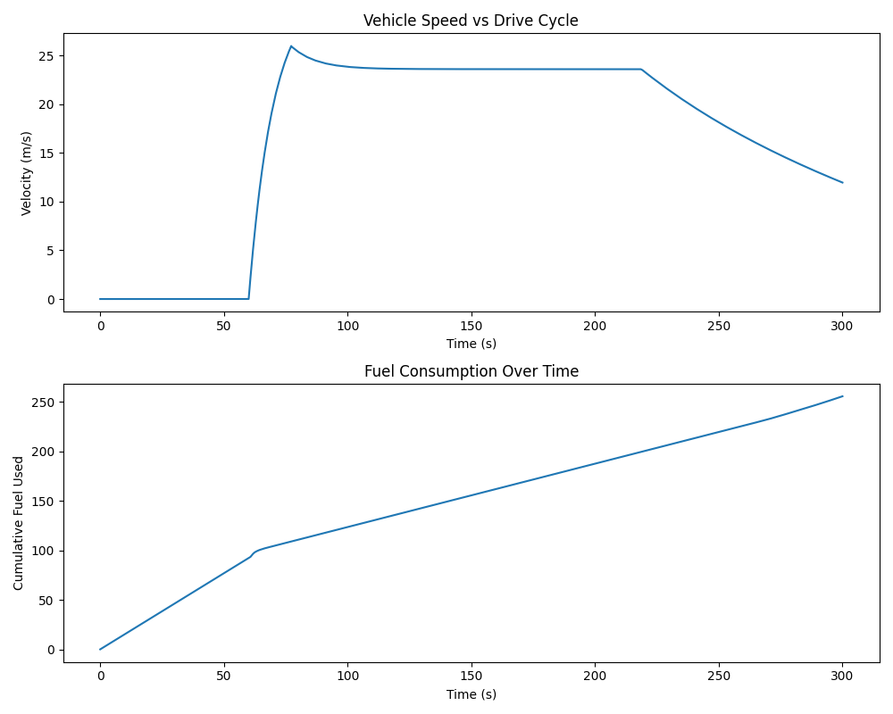

# Vehicle Dynamics + Fuel Model

Longitudinal dynamics simulation of a commercial truck, tracking a drive cycle and estimating fuel consumption. Built in MATLAB/Simulink with Python post-processing.

## Problem
Commercial vehicle fuel economy depends on vehicle mass, aerodynamic drag, rolling resistance, engine torque characteristics, and gear selection. This project builds a physics-based model to simulate and analyze these interactions over a realistic drive cycle.

## Approach
- Simulink model: vehicle body dynamics (drag + rolling resistance), engine torque curve (lookup table), speed-dependent gear ratio selection, PI-controller-based drive cycle tracking
- Solver: ode23tb (stiff solver), required due to nonlinear lookup table interactions
- Python: post-processing of simulation output speed tracking and fuel consumption visualization, fuel economy metrics

## Tech Stack
MATLAB, Simulink (Lookup Tables, PID Controller, Signal Editor), Python (pandas, matplotlib)

## Results

- Distance covered: 2.75 km
- Total fuel used: 255.58 units
- Fuel economy: 92.78 units/km

## What I'd improve
- Tighter PI tuning to reduce overshoot and track the drive cycle more precisely
- Replace the placeholder fuel-rate constant with a proper BSFC (brake specific fuel consumption) map
- Add multi-gear Stateflow-based shifting logic instead of continuous lookup-based ratio selection

## How to run
1. Open `models/vehicle_body_model.slx` in MATLAB/Simulink
2. Run simulation (Stop Time: 300s, Solver: ode23tb)
3. Export results: run the MATLAB export commands in the model or Command Window
4. Run `src/analyze_results.py` for Python post-processing and plots
