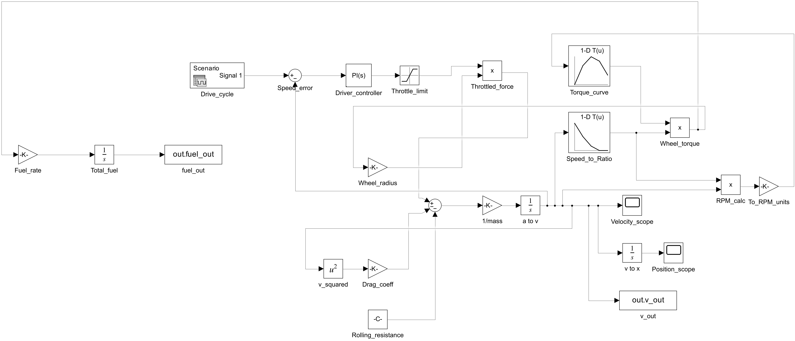
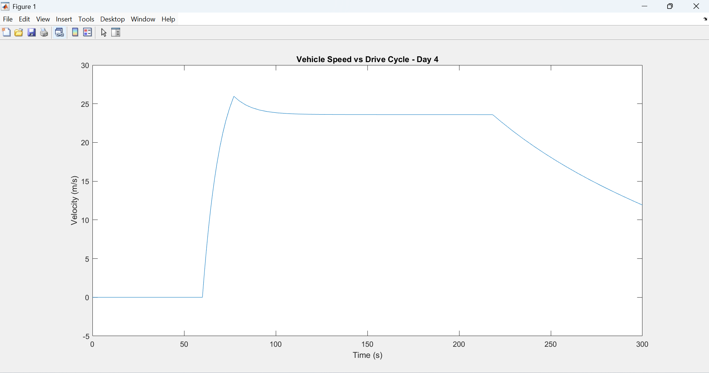
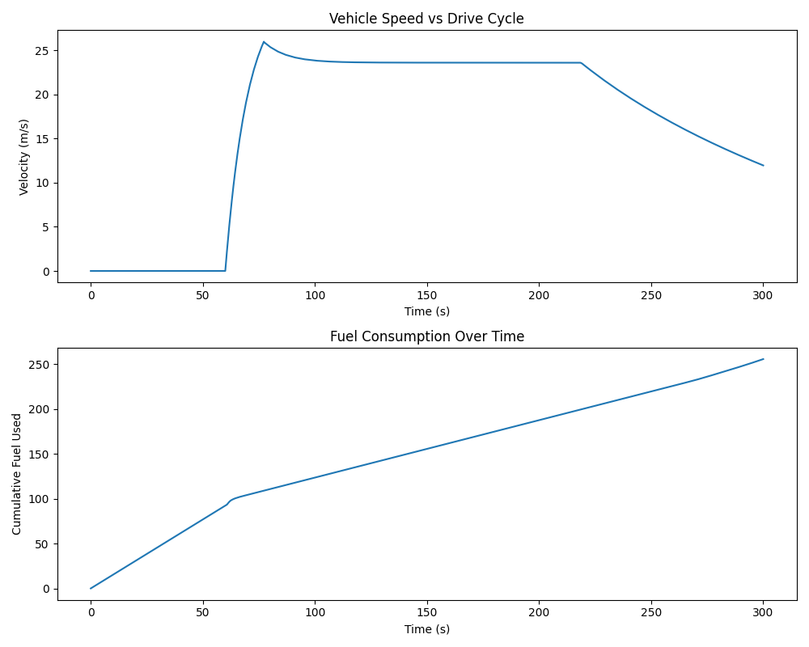

# Technical Documentation — Vehicle Dynamics + Fuel Model

## 1. Overview

This project simulates the longitudinal dynamics of a commercial truck in Simulink, tracks a target drive cycle using closed-loop control, and estimates fuel consumption — with Python used for post-processing and reporting. The goal was to combine classical vehicle dynamics modeling with a working data pipeline, similar to how a real vehicle simulation/calibration workflow would be structured.

## 2. System Architecture

The model is built as a closed loop:

```
Drive cycle (target speed) → Speed error → PI controller → Throttle limiter
    → Engine torque (RPM-dependent lookup table) → Gear ratio (speed-dependent lookup table)
    → Wheel force → Vehicle body (mass, drag, rolling resistance) → Velocity → fed back to start
```

Velocity is also integrated to get position, and wheel torque is used to estimate a fuel consumption rate, which is integrated to get cumulative fuel used.



## 3. Build Process (Day by Day)

**Day 1 — Vehicle body dynamics**
Built the core force balance: driving force minus aerodynamic drag minus rolling resistance, integrated twice to get velocity and position. Validated against a hand-calculated terminal velocity (~27 m/s) using a constant 3000 N driving force.

**Day 2 — Engine torque and gearbox**
Replaced the constant driving force with a proper drivetrain: engine RPM → torque curve (1-D lookup table) → gear ratio × final drive → wheel force. This made the model's force output physically derived rather than an arbitrary constant.

**Day 3 — Speed-dependent gear selection**
Originally attempted with a Stateflow state machine (4 discrete gear states with RPM-based transitions). Simplified to a continuous lookup-table-based approach (gear ratio as a function of speed) to keep the model easier to debug and extend, while preserving the same "higher speed → lower ratio" behavior of a real transmission.

*Debugging note:* this stage introduced a solver stiffness issue — two nonlinear lookup tables stacked in sequence (speed→ratio, then RPM→torque) created sharp derivative changes that the default `ode45` solver couldn't handle, causing the step size to collapse toward zero. Fixed by switching to `ode23tb` (a stiff solver) and setting both lookup tables' extrapolation method to `Clip` instead of `Linear`.



**Day 4 — Drive cycle tracking**
Added a target speed profile (Signal Editor block) and a PI controller that adjusts throttle to track it, with a saturation block limiting throttle to a realistic 0–1 range. This turned the model from "vehicle accelerates freely" into "vehicle follows a driving pattern," which is necessary for any meaningful fuel economy calculation.

**Days 5–7 — Fuel model, Python analysis, documentation**
Added a fuel consumption block (torque-based rate, integrated over time), exported simulation results to CSV, and built a Python script to visualize and summarize results (speed tracking plot, cumulative fuel plot, and computed fuel-economy metrics).

## 4. Results



- Distance covered: 2.75 km
- Total fuel used: 255.58 units
- Fuel economy: 92.78 units/km

The vehicle tracks the drive cycle reasonably well, with a moderate overshoot (~26 m/s vs. 20 m/s target) during the initial acceleration phase — a result of PI gains that prioritize responsiveness over precision. Fuel accumulates roughly linearly during the cruise phase, as expected.

## 5. Key Learnings

- Solver selection matters significantly once lookup tables or discrete-like nonlinearities are introduced — `ode23tb` was necessary once the model stopped being purely smooth/continuous.
- Extrapolation settings on lookup tables are an easy source of instability if the input signal briefly exceeds the defined breakpoint range.
- A simplified, well-understood implementation (continuous lookup-based gear selection) was chosen over a more complex one (Stateflow state machine) to keep the project debuggable and to prioritize a working end-to-end pipeline within the project timeline.

## 6. Future Improvements

- Replace the placeholder fuel-rate constant with a proper BSFC (brake specific fuel consumption) map for more realistic fuel estimates
- Revisit Stateflow-based discrete gear shifting once comfortable with Stateflow data scoping
- Tighter PI tuning to reduce the initial overshoot
- Test against a standardized drive cycle (e.g., WLTP or a CV-specific cycle) instead of a hand-drawn one
